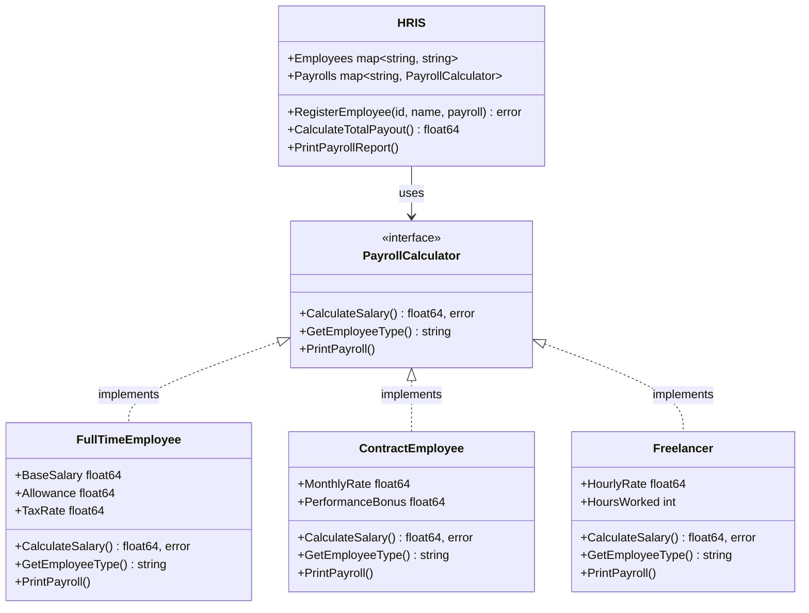
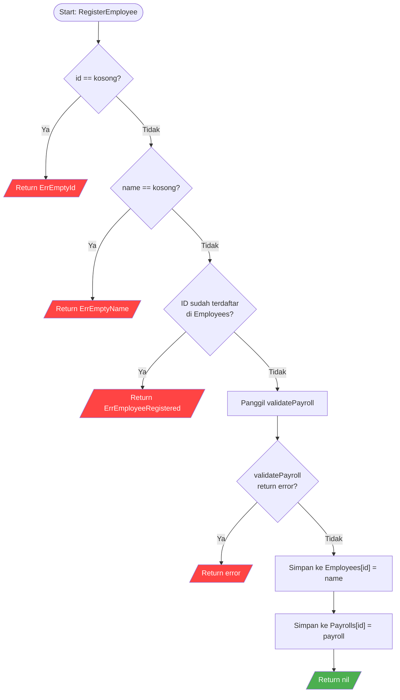
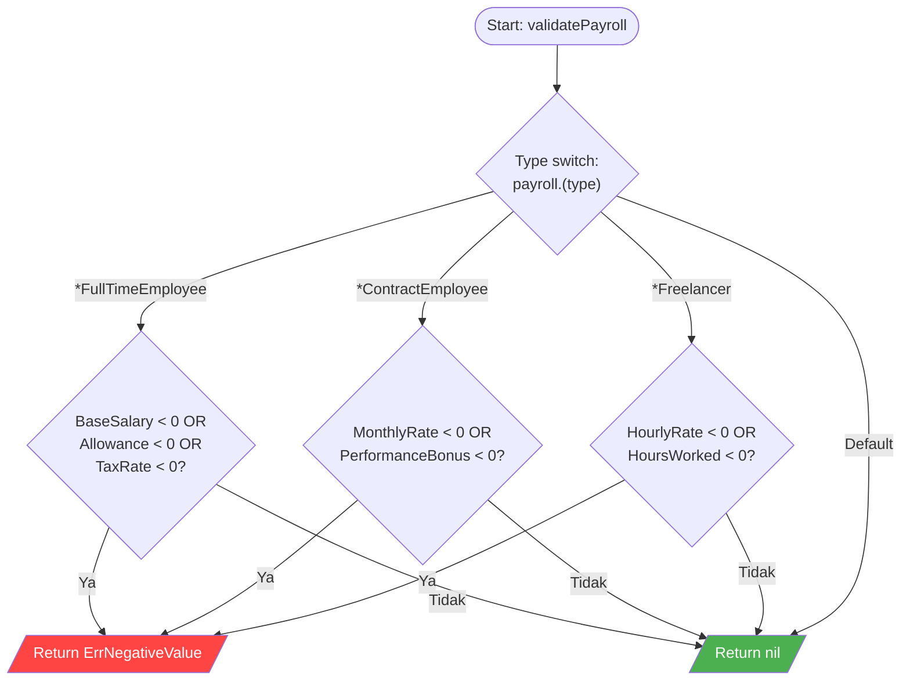
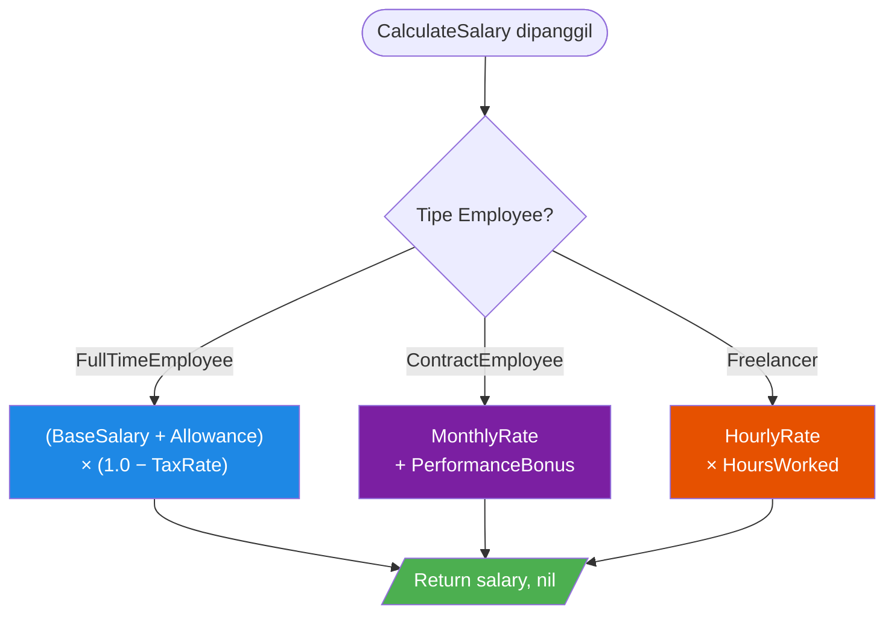
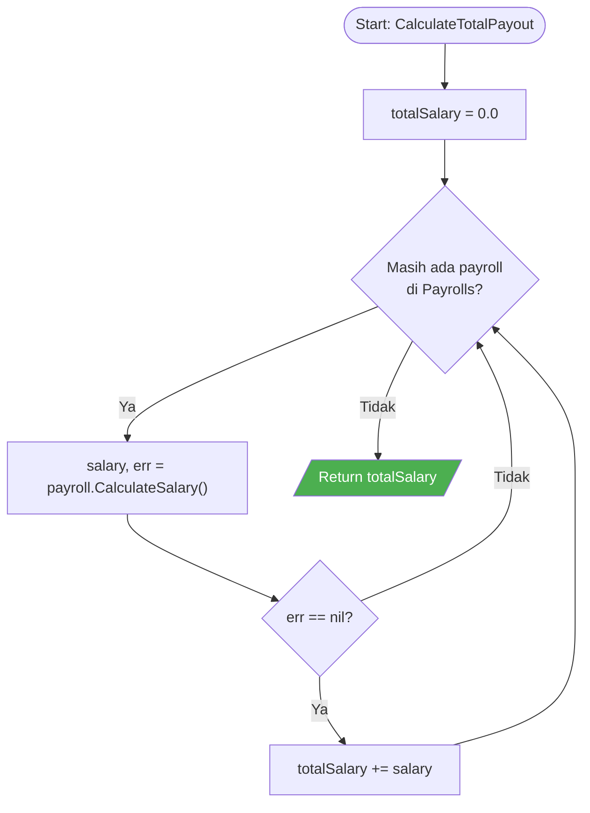
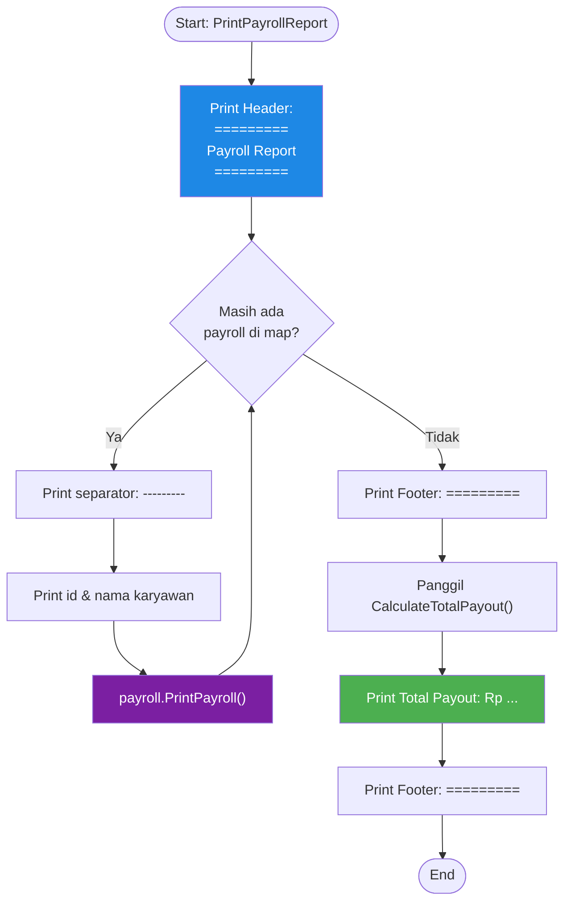

# Flowchart Diagram — HRIS Payroll System

> Diagram dibuat berdasarkan `gohrispayrollsystem.go`

---

## 1. Struktur & Relasi (Class Diagram)

---

## 2. Flowchart: RegisterEmployee

---

## 3. Flowchart: validatePayroll

---

## 4. Flowchart: CalculateSalary (Polymorphism)

---

## 5. Flowchart: CalculateTotalPayout

---

## 6. Flowchart: PrintPayrollReport

---

## 7. Flowchart Keseluruhan Sistem (Overview)

```mermaid
flowchart LR
    subgraph INPUT["📥 Input"]
        ID["id: string"]
        NAME["name: string"]
        PAYROLL["payroll: PayrollCalculator"]
    end

    subgraph REGISTER["📋 RegisterEmployee"]
        V1{"Validasi ID"}
        V2{"Validasi Nama"}
        V3{"Cek Duplikat"}
        V4["validatePayroll()"]
        SAVE["Simpan ke Maps"]
    end

    subgraph TYPES["👥 Tipe Karyawan"]
        FT["FullTimeEmployee<br>Gaji = (Base+Allowance)×(1−Tax)"]
        CT["ContractEmployee<br>Gaji = Monthly + Bonus"]
        FL["Freelancer<br>Gaji = Hourly × Hours"]
    end

    subgraph OUTPUT["📊 Output"]
        CALC["CalculateTotalPayout()"]
        REPORT["PrintPayrollReport()"]
    end

    INPUT --> V1
    V1 --> V2
    V2 --> V3
    V3 --> V4
    V4 --> SAVE

    SAVE --> TYPES

    TYPES --> CALC
    TYPES --> REPORT

    style FT fill:#1e88e5,color:#fff
    style CT fill:#7b1fa2,color:#fff
    style FL fill:#e65100,color:#fff
    style SAVE fill:#4caf50,color:#fff
    style CALC fill:#00897b,color:#fff
    style REPORT fill:#00897b,color:#fff
```

